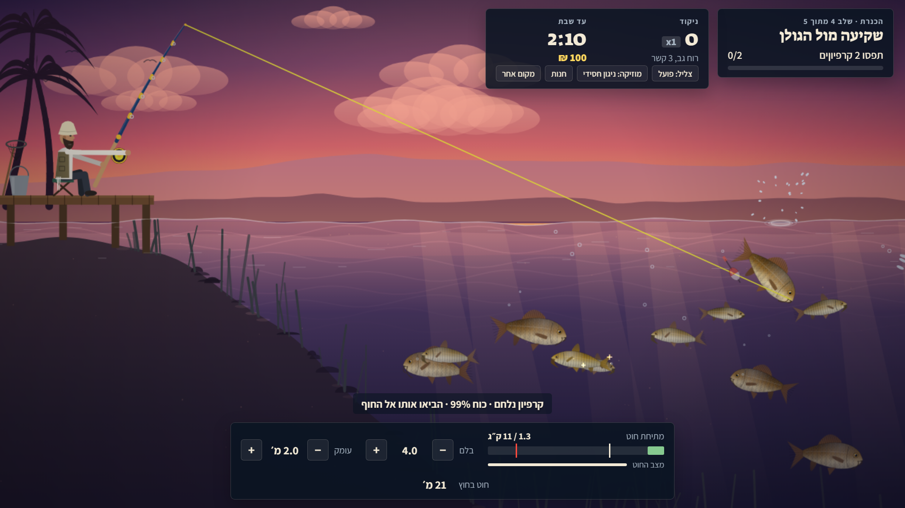
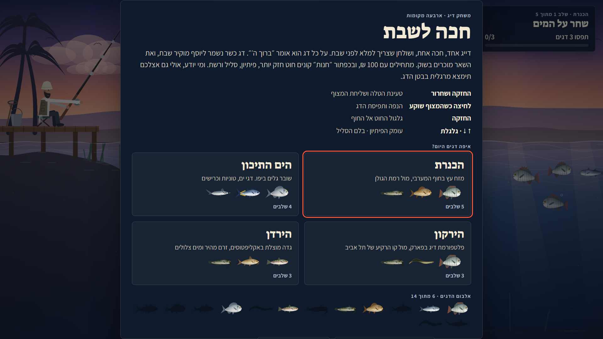
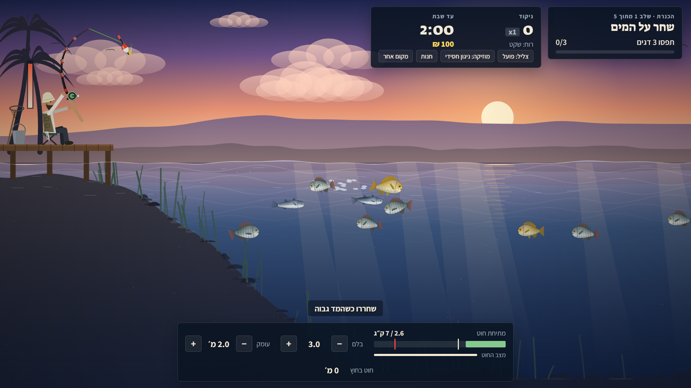
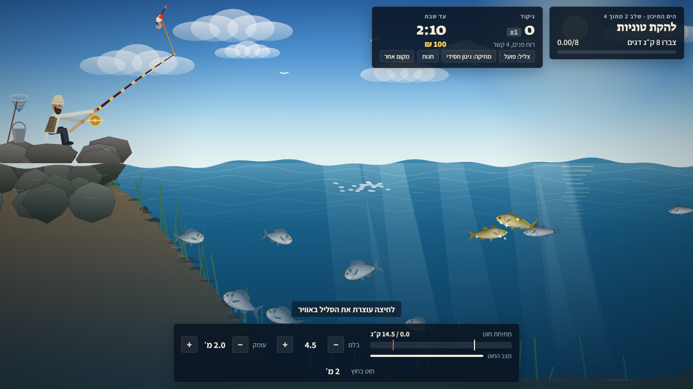
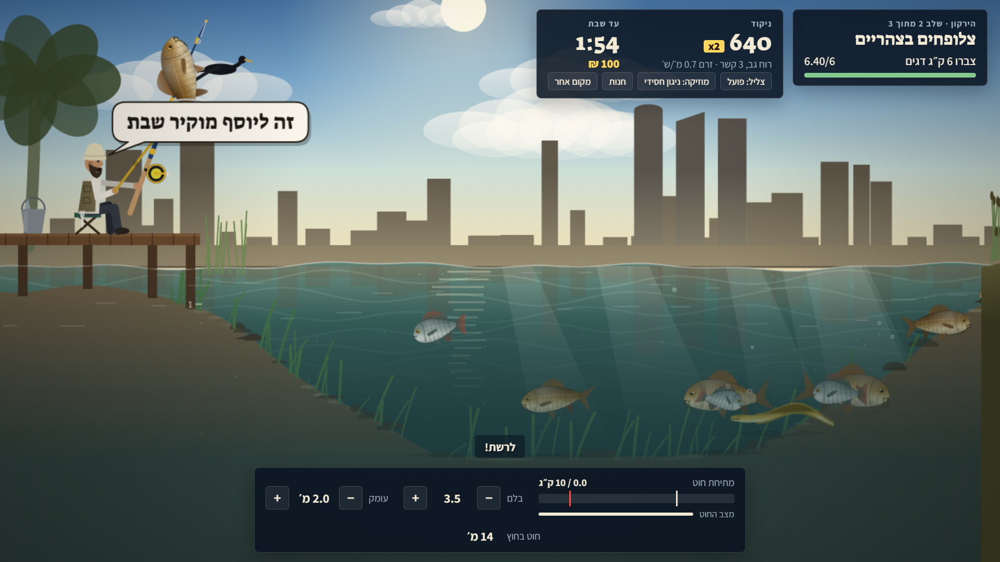
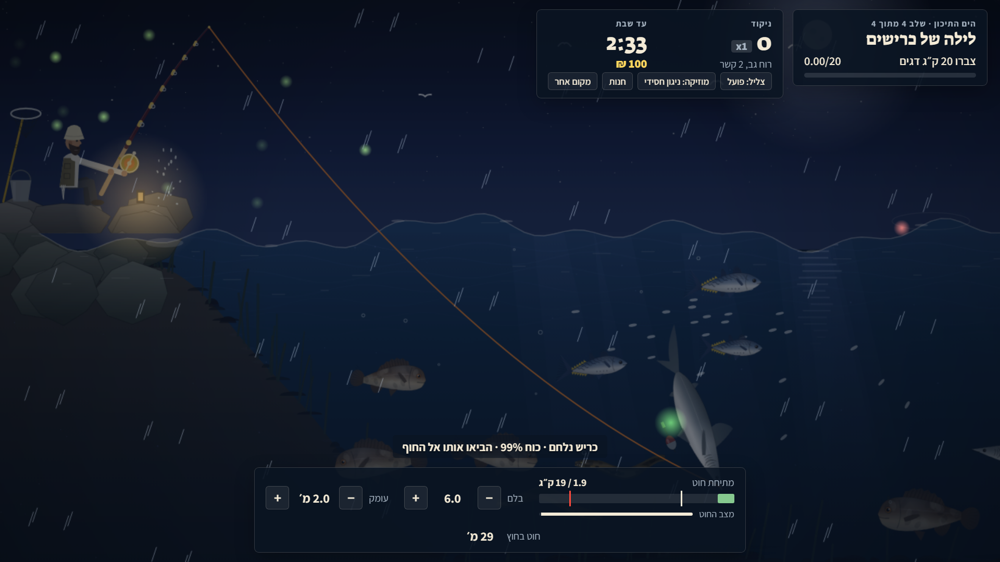
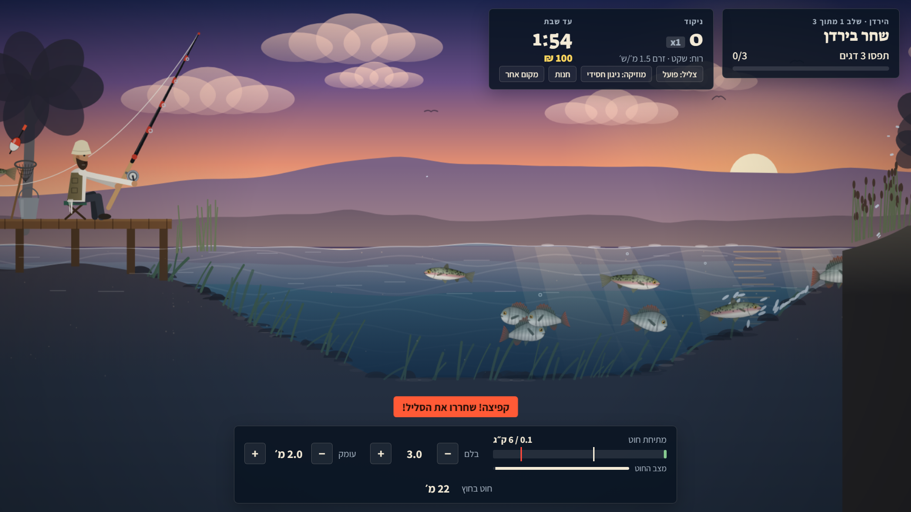
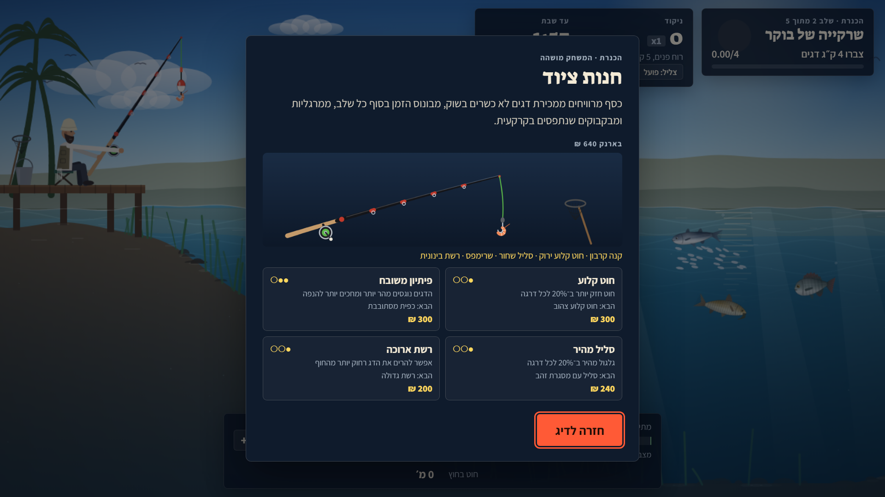
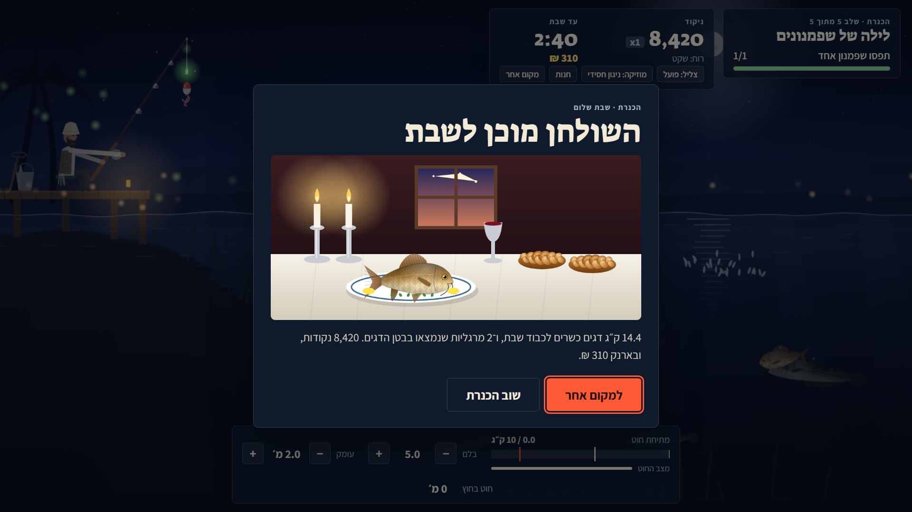

# חכה לשבת 🎣

משחק דיג בדפדפן, בחינם ובלי התקנה.

**לשחק עכשיו:** https://vizel014.github.io/hakhaleshabat/

דייג אחד, חכה אחת, ושולחן שצריך למלא לפני שבת. על כל דג הדייג אומר "ברוך ה׳", דג כשר נשמר ליוסף מוקיר שבת, ואת השאר מוכרים בשוק וקונים בכסף ציוד. ומי יודע, אולי גם אצלכם תימצא מרגלית בבטן הדג.

## ארבעה מקומות

| מקום | מה מחכה שם |
|---|---|
| **הכנרת** | מזח עץ מול הגולן. אמנון, בורי, בינית, קרפיון, שפמנון, ושפמנון ענק שקורע חוטים |
| **הים התיכון** | שובר גלים ביפו. דניס, לברק, לוקוס, טונית, מורנה וכריש |
| **הירקון** | פלטפורמה בפארק מול עזריאלי. אמנון, קרפיון, צלופח ושפמנון, עם זרם |
| **הירדן** | גדה עם אקליפטוסים וזרם מהיר. פורל, בינית ושפמנון |

## איך משחקים

- **החזקה ושחרור:** הדייג מניף את החכה לאחור ומטיל.
- **לחיצה כשהמצוף שוקע:** הנפה.
- **החזקה:** גלגול החוט.
- **↑ ↓:** עומק הפיתיון.
- **גלגלת או ← →:** בלם הסליל.
- **דג קופץ?** שחררו את הסליל עד שינחת.
- **דג בסלעים** שוחק את החוט.
- **מתיחה מעל חוזק החוט** קורעת אותו.

בטלפון כדאי לשחק לרוחב.

## עוד בפנים

- **חנות ציוד:** חוט קלוע, פיתיון, סליל ורשת. רואים את החכה משתדרגת בעיניים.
- **מרגליות** בבטן הדג, **סערות** באמצע שלב, **קורמורנים** צוללים, ו**זבל** מהקרקעית. כולל בקבוק עם פתק.
- **מוזיקה מקורית:** ניגון חסידי ושלושה קטעים מזרחיים במקאמים חיג׳אז, ראסט וביאת. אפשר גם לנגן שיר מהמכשיר.
- **שולחן שבת** בסוף כל מקום, עם הדג הכשר הכי גדול שתפסתם.
- **אלבום דגים, שיאים וכסף:** נשמרים בדפדפן.

## צילומי מסך

| | |
|---|---|
|  |  |
|  |  |
|  |  |
|  |  |

## טכני

קובץ HTML אחד, בלי ספריות. גרפיקה ב־Canvas, פיזיקה מבוססת מיקום (חוט אלסטי, בלם סליל, ציפה, זרם), וצליל ב־Web Audio.
